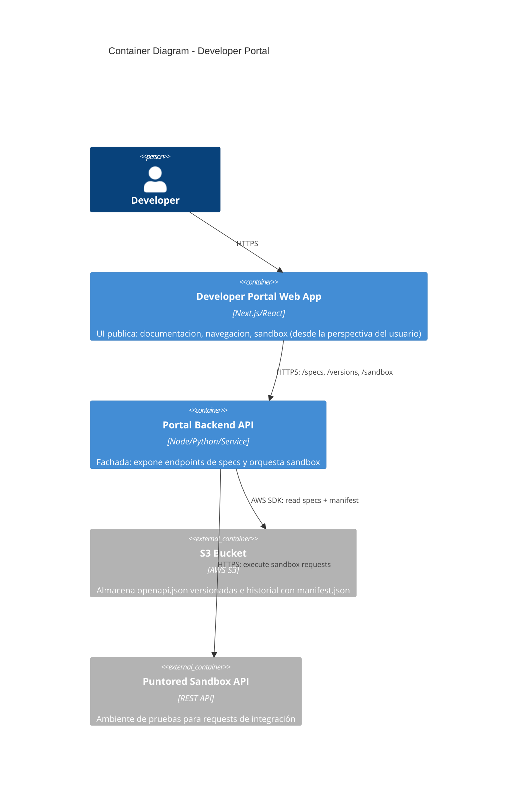

```mermaid
C4Container
  title Container Diagram - Developer Portal

  Person(developer, "Developer")

  Container(portalWeb, "Developer Portal Web App", "Next.js/React", "UI publica: documentacion, navegacion, sandbox (desde la perspectiva del usuario)")
  Container(portalBackend, "Portal Backend API", "Node/Python/Service", "Fachada: expone endpoints de specs y orquesta sandbox")

  Container_Ext(s3, "S3 Bucket", "AWS S3", "Almacena openapi.json versionadas e historial con manifest.json")
  Container_Ext(puntoredSandbox, "Puntored Sandbox API", "REST API", "Ambiente de pruebas para requests de integración")

  Rel(developer, portalWeb, "HTTPS")
  Rel(portalWeb, portalBackend, "HTTPS: /specs, /versions, /sandbox")

  Rel(portalBackend, s3, "AWS SDK: read specs + manifest")
  Rel(portalBackend, puntoredSandbox, "HTTPS: execute sandbox requests")
```

