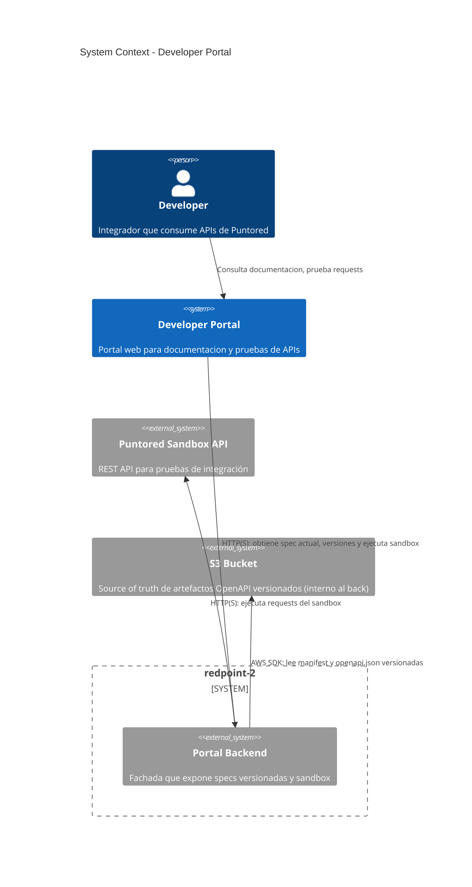

```mermaid
C4Context
  title System Context - Developer Portal

  Person(developer, "Developer", "Integrador que consume APIs de Puntored")

  System(portal, "Developer Portal", "Portal web para documentacion y pruebas de APIs")
  System_Boundary(portalBoundary, "redpoint-2") {
    System_Ext(portalBackend, "Portal Backend", "Fachada que expone specs versionadas y sandbox")
  }

  System_Ext(puntoredSandbox, "Puntored Sandbox API", "REST API para pruebas de integración")
  System_Ext(s3, "S3 Bucket", "Source of truth de artefactos OpenAPI versionados (interno al back)")

  Rel(developer, portal, "Consulta documentacion, prueba requests")
  Rel(portal, portalBackend, "HTTP(S): obtiene spec actual, versiones y ejecuta sandbox")
  Rel(portalBackend, s3, "AWS SDK: lee manifest y openapi.json versionadas")
  Rel(portalBackend, puntoredSandbox, "HTTP(S): ejecuta requests del sandbox")
```

