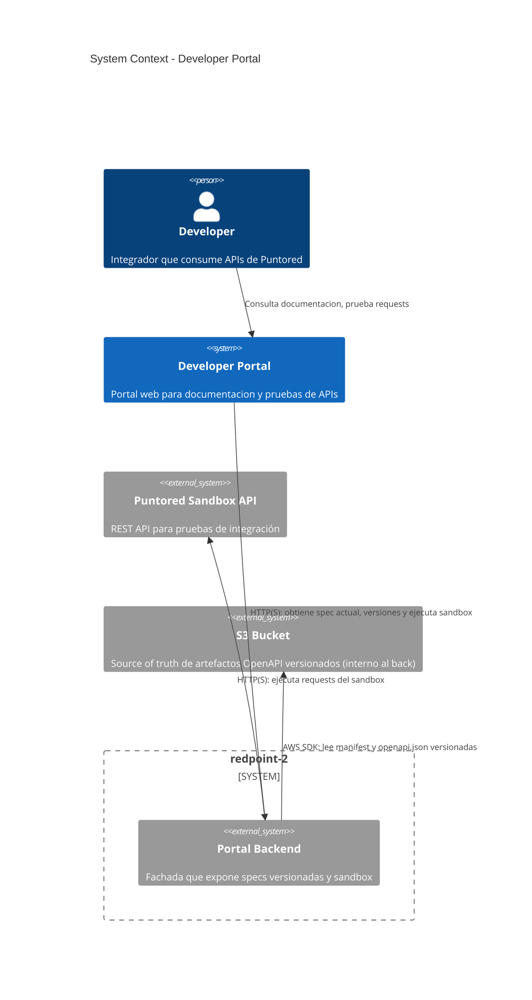
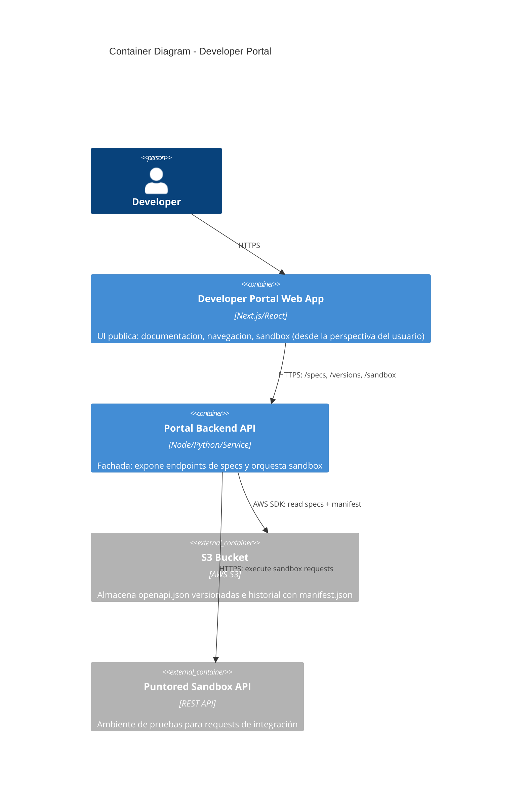
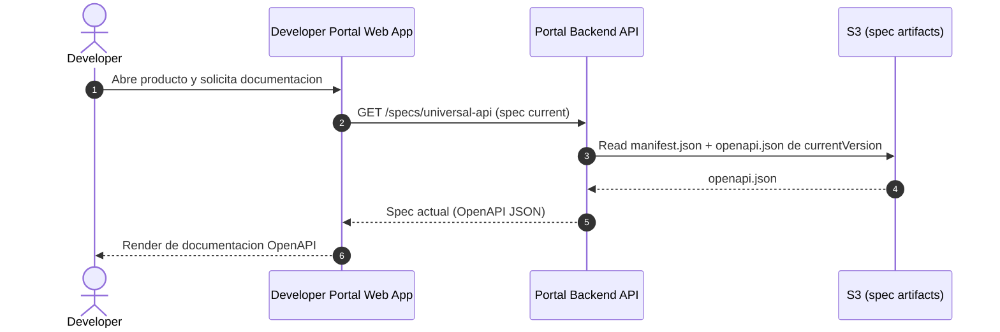
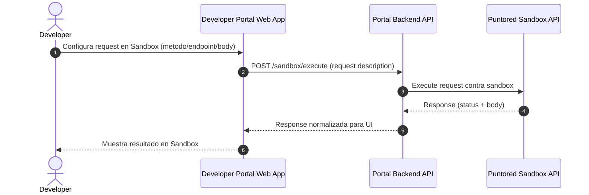

# HLD - Developer Portal (redpoint-2)

**Title:** HLD - Developer Portal (redpoint-2)  
**Author:** (pendiente)  
**Version:** 0.1  
**Date:** 2026-03-25  
**Status:** Draft

## Executive Summary & Context

El **Developer Portal** es un sitio web público destinado a integrar las APIs financieras de Puntored. Hoy el portal requiere documentacion **dinamica** basada en **OpenAPI**, pero no debe acoplarse a la API de pagos ni a la lógica interna del backend del sistema.

El problema principal es garantizar que las especificaciones OpenAPI usadas por el portal:
1) estén **siempre actualizadas** cuando cambian las APIs,  
2) se puedan **versionar** para trazabilidad y consistencia,  
3) permitan que la UI pueda consultar la **spec actual** y versiones históricas sin duplicar lógica.

La solución propuesta es separar responsabilidades: un **Portal Backend** actua como fachada/controlador, y obtiene las especificaciones desde **S3 como source of truth** (incluyendo `manifest.json` y versiones inmutables). El **frontend (redpoint-2)** consume únicamente endpoints del Portal Backend para:
- leer la spec OpenAPI "current",
- listar versiones disponibles,
- obtener una versión específica para reproducibilidad,
- y ejecutar un flujo de **sandbox** de pruebas contra el ambiente de Puntored.

## Scope Definition

### In Scope (3.1)
- Presentar documentación de APIs basada en OpenAPI (OpenAPI 3.x).
- Navegar por APIs / productos y mostrar sus especificaciones.
- Obtener la **spec actual** de forma consistente.
- Listar versiones y obtener una versión específica.
- Exponer un flujo de **sandbox** para ejecutar requests de prueba.
- Soporte de internacionalizacion (por ejemplo `es` / `en`).
- Adaptacion conceptual de ejemplos segun contexto (paises/regiones) provisto por la capa UI/Backend.

### Out of Scope (3.2)
- Gestion de usuarios/roles del portal (portal publico informativo).
- Persistencia de especificaciones OpenAPI desde el frontend (el frontend solo consume).
- Generacion/pipeline de publicaciones de artifacts OpenAPI (responsabilidad del back/proceso CI/CD).
- Monitoreo operacional del backend (se define a nivel conceptual en el HLD).

## System Context (C4 Level 1)

### Narrative
- El **Developer Portal** esta en el lado cliente y sirve como interfaz de documentacion y pruebas.
- El **Portal Backend** es el punto de acceso para la UI (evita acoplar la UI a almacenamiento o lógica interna).
- **S3** queda encapsulado en el back: el frontend no accede directamente.
- El **sandbox** se ejecuta contra el ambiente de pruebas de Puntored, invocado por el Portal Backend.

## Main Containers (C4 Level 2)

### Responsibilities (high-level)
- **Developer Portal Web App**
  - Presenta documentación y la interfaz de sandbox.
  - Consume endpoints del Portal Backend para obtener specs y ejecutar pruebas.
- **Portal Backend API**
  - Provee APIs para consultar `current` y versiones específicas de OpenAPI.
  - Expone un flujo de sandbox para ejecutar requests contra el ambiente de Puntored.
  - Administra la lectura de artefactos desde S3 (incluyendo `manifest.json`).

## Requirements

### Functional Requirements
- **FR-01:** Visualizar catalogo/APIs disponibles en el Developer Portal.
- **FR-02:** Renderizar documentación OpenAPI (incluyendo ejemplos) para una API/producto.
- **FR-03:** Obtener la **spec OpenAPI actual** de la API universal a traves del Portal Backend.
- **FR-04:** Listar versiones disponibles y su metadata (para trazabilidad).
- **FR-05:** Obtener una versión específica de la spec OpenAPI (inmutabilidad para reproducibilidad).
- **FR-06:** Ejecutar requests en modo **sandbox** desde el portal.
- **FR-07:** Mostrar un changelog/version history basado en el mismo origen de versiones.
- **FR-08:** Internacionalizacion (por ejemplo `es` / `en`) y adaptación de ejemplos segun contexto.

### Non-Functional Requirements
- **NFR-P1:** Tiempo de carga inicial aceptable para un sitio informativo (p95 < 3s bajo carga normal).
- **NFR-P2:** Tiempo de respuesta para cargar spec OpenAPI (p95 < 1s para el endpoint de specs).
- **NFR-A1:** Disponibilidad del portal y de la consulta de specs (objetivo 99.5% como referencia inicial).
- **NFR-S1:** Soportar specs OpenAPI de tamano grande (objetivo hasta 5MB por spec).
- **NFR-SEC1:** Comunicacion cifrada (HTTPS) y ausencia de secretos persistidos en el frontend.

## Architectural Strategies

### 7.1 Security
- El portal es publico y no requiere autenticacion de usuarios.
- El Portal Backend valida/normaliza inputs del sandbox y aplica controles conceptuales antes de ejecutar llamadas externas.
- El almacenamiento de especificaciones OpenAPI se mantiene en S3 desde el back (el frontend no maneja accesos a S3).
- Todas las comunicaciones entre containers usan HTTPS.

### 7.2 Scalability
- Escalado horizontal del Portal Backend (stateless).
- Resiliencia ante latencia de artefactos usando caching conceptual (TTL corto) dentro del back.
- El portal escala principalmente por demanda de lectura (consultas de specs y renderizacion de contenido).

### 7.3 Observability
- Observabilidad conceptual desde el Portal Backend:
  - métricas de errores y latencias por endpoint (specs, versions, sandbox).
  - trazabilidad de requests desde la UI hacia el backend.
- Logging estructurado sin incluir datos sensibles.
- Alertas ante fallas de lectura de artefactos o errores de consistencia entre `manifest.json` y specs.

## Decisions, Risks & Costs

### 8. Key Architectural Decisions
- **ADR-001:** S3 como source of truth para specs OpenAPI.
  - Justificacion: versionado nativo, bajo costo, alta disponibilidad y adecuacion a artifacts inmutables.
- **ADR-002:** Portal Backend como fachada para aislar al frontend del origen de datos (S3) y de la lógica de sandbox.
- **ADR-003:** Frontend (redpoint-2) consume endpoints del Portal Backend en lugar de acceder directamente al almacenamiento o a la infraestructura interna.

### 9. Risks and Assumptions
- **Risk:** Inconsistencia entre `manifest.json` y las specs correspondientes (por publicacion parcial).
  - Mitigacion (conceptual): validaciones en pipeline y validacion de integridad antes de marcar `current`.
- **Risk:** Publicaciones repetidas o fuera de orden.
  - Mitigacion (conceptual): versionado por commit/hash y reglas de idempotencia a nivel del proceso de publicacion.
- **Risk:** Latencia o indisponibilidad durante la lectura de specs desde S3.
  - Mitigacion (conceptual): caching con TTL corto, y fallback controlado a la ultima spec `current` verificada.

**Assumptions**
- El proceso de publicacion CI/CD genera artifacts validos de OpenAPI y actualiza `current` via manifest.
- El Portal Backend implementa endpoints estables para consultar specs y versiones.
- El ambiente de sandbox de Puntored esta disponible para ejecucion de pruebas.

### 10. Cost Considerations
- Cost drivers principales:
  - hosting del frontend (contenido/estatico),
  - compute del Portal Backend,
  - costo de almacenamiento y requests de S3,
  - data transfer entre containers (segun trafico).
- Estimaciones iniciales (orden de magnitud):
  - bajo/moderado para el inicio; los costos se escalan principalmente con trafico de lectura de specs y sandbox usage.

## Maintenance

- Actualizar este HLD cuando:
  - cambien los endpoints de Portal Backend o la estrategia de versionado,
  - se agreguen cambios mayores en el flujo sandbox o en el modo de consulta de specs,
  - se modifique significativamente el contrato de intercambio entre frontend y backend.
- Cambios menores (tuning de UI, refactors internos) no requieren reescritura completa.

## Diagrams - Sequence Flows

### Consulta de spec OpenAPI (current + versioning)

### Sandbox: ejecutar requests de prueba

