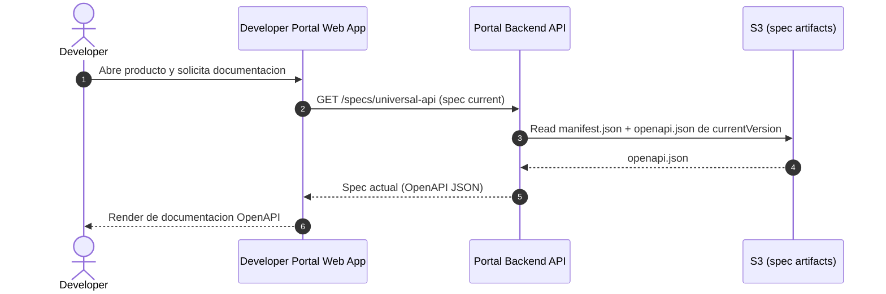
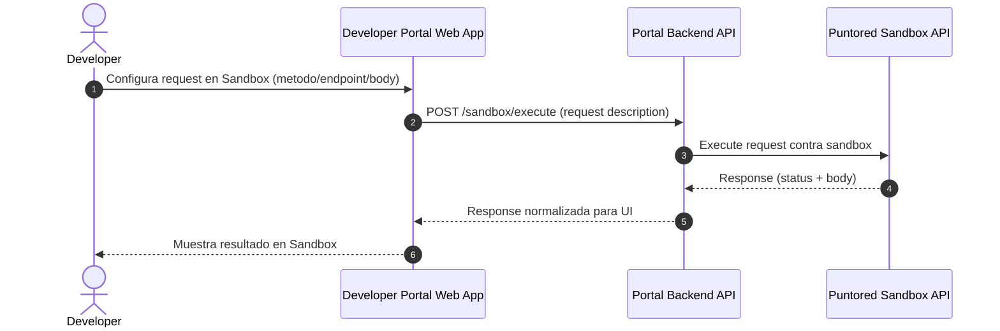

## Sequence - Consulta de spec OpenAPI (current + versioning)

```mermaid
sequenceDiagram
  autonumber
  actor Developer
  participant PortalWeb as Developer Portal Web App
  participant PortalBackend as Portal Backend API
  participant S3 as S3 (spec artifacts)

  Developer->>PortalWeb: Abre producto y solicita documentacion
  PortalWeb->>PortalBackend: GET /specs/universal-api (spec current)
  PortalBackend->>S3: Read manifest.json + openapi.json de currentVersion
  S3-->>PortalBackend: openapi.json
  PortalBackend-->>PortalWeb: Spec actual (OpenAPI JSON)
  PortalWeb-->>Developer: Render de documentacion OpenAPI
```

## Sequence - Sandbox: ejecutar requests de prueba

```mermaid
sequenceDiagram
  autonumber
  actor Developer
  participant PortalWeb as Developer Portal Web App
  participant PortalBackend as Portal Backend API
  participant PuntoredSandbox as Puntored Sandbox API

  Developer->>PortalWeb: Configura request en Sandbox (metodo/endpoint/body)
  PortalWeb->>PortalBackend: POST /sandbox/execute (request description)
  PortalBackend->>PuntoredSandbox: Execute request contra sandbox
  PuntoredSandbox-->>PortalBackend: Response (status + body)
  PortalBackend-->>PortalWeb: Response normalizada para UI
  PortalWeb-->>Developer: Muestra resultado en Sandbox
```

